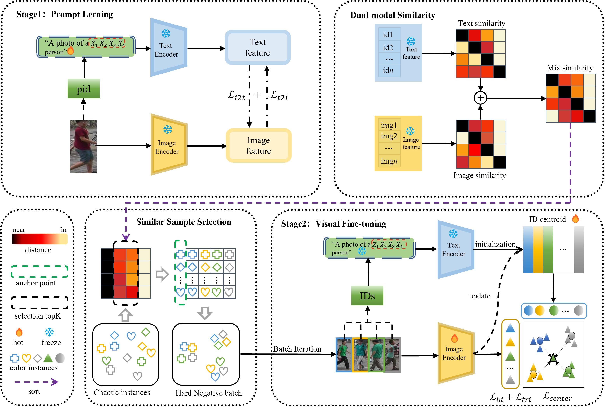
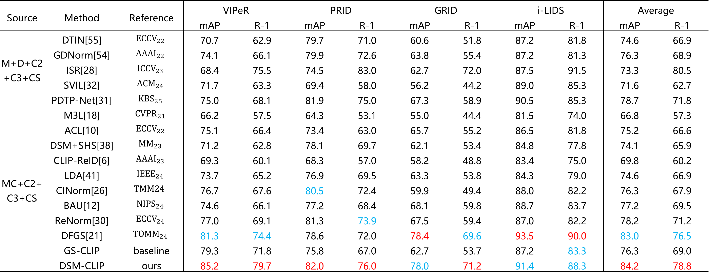

## DSM-CLIP: DSM-CLIP: A Framework Designed for Hard Negative Sampling in Generalizable Person Re-Identification





## Requirements

##### Our code is modified and organized based on [CLIP-ReID](https://github.com/Syliz517/CLIP-ReID) and [CLIP-FGDI](https://github.com/Qi5Lei/CLIP-FGDI).

Thanks for their contributions.


## Dataset
You can run the project by modifying the corresponding configuration (cfgS) files and using the run.py script.

## Experiment

Our method has achieved excellent results.




# Citation

```tex

```
